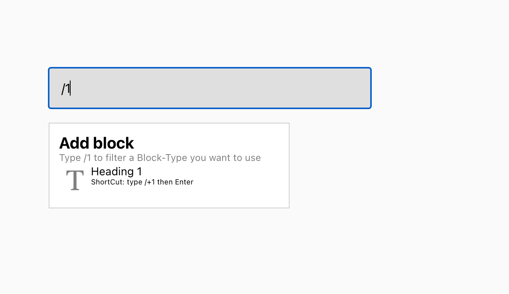

# Help Jiuce test Project:

Goal:
In the project,i built a Notion-like editor, but only the H1 heading component. So it’s not much of an editor, but rather an app that lets you write anywhere and convert your content into H1.

## Build on Top of:

- Reatjs

## Live Demo

[Help Jiuce live Link](https://jenadiusnicholaus.github.io/helpjuice_test_project/)

## Clone the Project

To get a local copy of the project, running follow these simple example steps.

```python
 git clone git@github.com:jenadiusnicholaus/helpjuice_test_project.git

 then:
 cd helpjuice_test_project
 then:

 git checkout develop

```

```
Note: always use the develop branch bacause the main brach is use for deployment, so some files are hidden in producttion.
```

## Screenshot of the project



👤 **Author1**

- GitHub: _[@jenadiusnicholaus](https://github.com/jenadiusnicholaus/)_.
- Twiter: _[@jenadius_kaim](https://twitter.com/jenadius_kaim)_.
- LinkedIn: _[@Jenadius Nicholaus](https://www.linkedin.com/in/jenadius-nicholaus-73126819b/)_.

#### 🤝 Contributing

Contributions, issues, and feature requests are welcome!

Feel free to check the [issues page](../../issues/).

#### 📝 License

This project is [MIT](./MIT.md) licensed.
